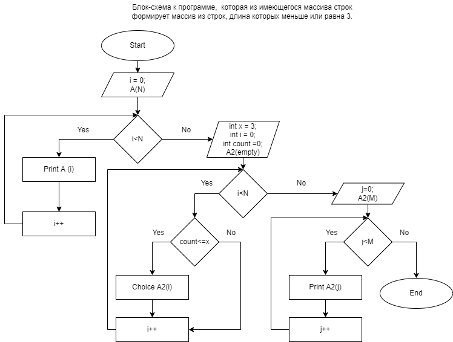

***Задача:*** *"Написать программу, которая из имеющегося массива строк формирует массив из строк, длина которых меньше или равна 3 символам"*

## **Решение задачи**

В ходе решения задачи были выполнены следующие действия:

1. Создан репозиторий на веб-сервисе GitHub

2. Составлена блок-схема решения задачи, которая предусматривает использование двух циклов для вывода на печать двух массивов - заданного и преобразованного .

3. Выполнено решение задачи на языке C#: 
* вывод на экран заданного массива производится при помощи цикла for;
* получение заданного массива производится при помощи метода Choice, использующего циклы for и if;
* вывод на экран преобразованного массива производится при помощи метода PrintArray, использующего цикл for.

4.  Решение загружено на веб-сервис GitHub.
5. Подготовлен файл с описанием решения задачи REEDME.md